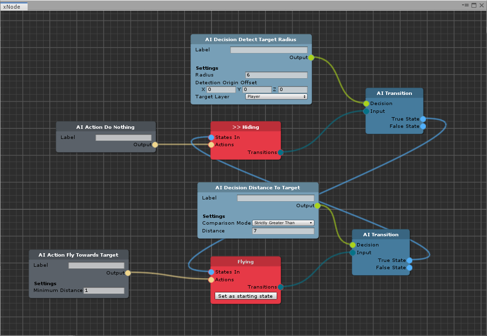

# AI Brain Graph for Corgi Engine

This is an extension for the Unity3D [Corgi Engine ](https://assetstore.unity.com/packages/templates/systems/corgi-engine-2d-2-5d-platformer-26617?aid=1011lHJn). It uses [xNode]() to create AI Brain graphs that can generate regular Corgi AI sustems.

For a tour of [Corgi Engine ](https://assetstore.unity.com/packages/templates/systems/corgi-engine-2d-2-5d-platformer-26617?aid=1011lHJn) features, please check this video: [https://www.youtube.com/watch?v=b8bAt1i9gfo](https://www.youtube.com/watch?v=b8bAt1i9gfo).

# Features

* AI Brain Graph including:
  * States
  * Transitions
  * Actions
  * Decisions
* _AI Brain Generator_: to create Corgi AIBrain systems (with AIDecisions and AIActions)
* _AI pluggable brain_: to generate AI systems at runtime
 
# Release Notes

See the [dedicated page](https://github.com/marcosecchi/ai-brain-graph-for-corgi/blob/master/RELEASE.md).

# Documentation

Tool documentation can be found on the [project Wiki](https://github.com/marcosecchi/ai-brain-graph-for-corgi/wiki).
